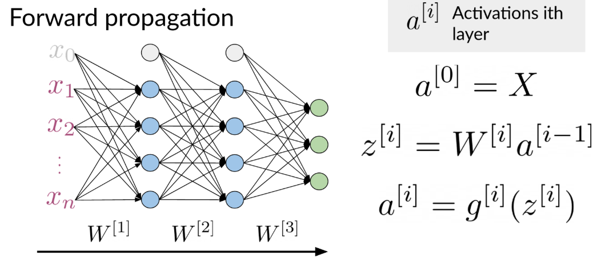
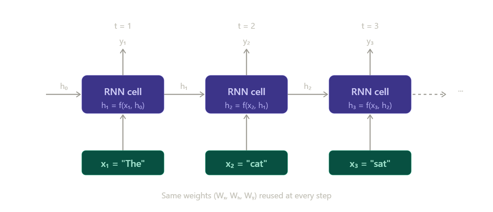
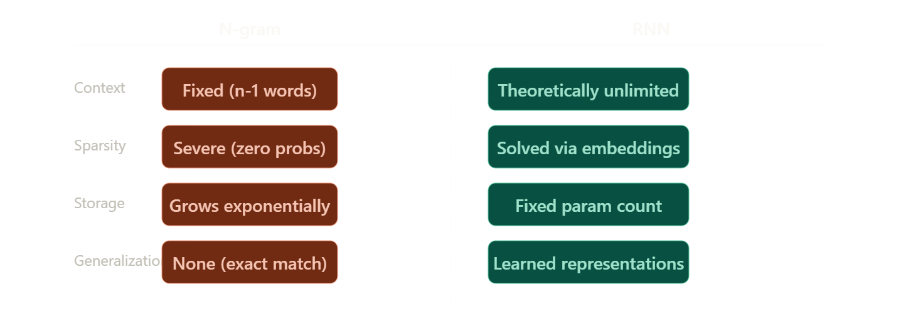

<style>
/* General note styling */  
  body {
    font-size: 130%;
  }

    img {
    display: block;
    margin: 20px auto;
    max-width: 70%;
    }

    .math {
    text-align: center;
}
</style>

# NLP using sequential models

## Neural Networks



Every word in the training set has a corresponding integer and each tweet has a vector representation of all words inside it.  
The size of the vector representation is = to the size of the longest tweet.  
Every other tweet have 0s to match the size of the longest tweet which known as **padding.**  

---

## Neural Networks layers  

- Dense layer: A layer where each Neural is connected to the all neurons  of the previous layer  
  
- ReLU: Transforms a neuron's output by outputting the input directly if it is positive, and returning zero for all negative values.

- Embedding layer: Takes an index assigned to each word from the vocabulary, and maps it to a representation of that word with a determined dimension.
- Mean layer: A layer that takes the mean of each feature from the embedding, and it output the same number of features as teh embedding sites. It doesn't have any trainable parameters.

## Traditional language models

### N-grams

An n-gram is a sequence of n consecutive words (or characters) from a text. The idea is that you can estimate the probability of a word based on the words that came before it.  

$$P(w2|w1) = \frac{\text{count(w1,w2)}}{\text{count(w1)}} → Bigrams$$  
$$P(w3|w1,w2) = \frac{\text{count(w1,w2,w3)}}{\text{count(w1,w2)}} Trigrams$$  
$$P(w1,w2,w3) = P(w1) \times P(w2|w1) \times P(w3|w2)$$  

  

#### Limitations of N-gram

- Large N-grams needed to capture dependencies between distant words.
- Exponential growth: Increasing n gives better context byt explodes the vocabulary size which needs a lot of space and RAM.
- Sparsity problem: most word combinations never appear in training, its count is 0 making P = 0. The model assigns zero probability to valid sentences it just never saw it. Smoothing techniques (like Laplace smoothing) patch this but don't fully solve it.
- Fixed context window: an n-gram only looks back n-1 words. A bigram is completely blind to anything beyond the previous word.
- No semantic understanding: n-grams are pure statistics over word sequences. "Dog bites man" and "canine attacks person" are completely different patterns to an n-gram model, even though they mean the same thing.  

---

## Recurrent neural networks (RNN)

An RNN process a sequence one token at time, maintaining a hidden state that gets updated at each step. The key idea: the hidden state is a form of memory, it carries information from previous steps into the current one.  

At each step $t$:

- Input: current word $x_t$ (as vector/embedding)
- previous hidden state:  $h_{t-1}$
- New hidden state $h_t = tanh (W_x \cdot X_t + W_h \cdot h_{t-1} + b)$
- Output $y_t = W_{\gamma} \cdot h_t$  

The same weight matrices ($W_x W_h W_{\gamma}$) are reused at every step, that's what "recurrent" means



---

### Why is RNN better than n-grams (what is solved)

- **Unlimited context window**: the hidden state theoretically carries information form the very first token all the way to the current one. There is no fixed n; every previous word influences the current hidden state.

- **No sparsity problem**: instead of counting raw co-occurrences, the RNN learns continuous vector representations (embeddings). Two words that appear in similar contexts get similar embeddings, so the model generalizes across unseen combinations naturally.
  
- **Semantic compression**: the hidden state is a dense vector that compresses *meaning*, not just word identity. Related sentences get similar hidden states even if they use different words.

- **No exponential storage growth**: the model parameters are fixed regardless of sequence length. The RNN doesn't need a lookup table that grows with the vocabulary size the way n-gram count tables do



---

### Applications of RNNs


**One to one task**: A single input produces a single output. Ex: a list of football scores (input) used to predict leaderboard position (output).  
The Rnn is not very useful here as this is barely different from a regular feed forward neural network. The RNN just adds a hidden state $h_0$, but since there's no real sequence to process that hidden state doesn't do anything meaningful. A standard neural network handles this just fine.  

**One to Many task**: A single input generates a sequence of outputs.Ex an image (single input) → a caption in English (multiple word output).  
The RNN is very useful as after reading the image once, the RNN needs to generate words one by one, where each word depends on the previous ones. That's exactly what the hidden state is good for, it carries context from one generation step to the next, allowing the model to produce coherent multi-word output instead of independent random words.  

**Many to one task**: A sequence of inputs collapses into a single output. Ex a tweet like "I am very happy" (multiple words) → a single sentiment label (positive or negative).  
The RNN is very useful as it reads every word one at a time, propagating information from the beginning to the end. By the time it reads the last words, the hidden state has accumulated context from the entire sentence. A single output is then produced from this final hidden state. without sequential processing, the model couldn't capture that "not" earlier in a sentence negates a word that comes much later.  

**Many to many task**: Multiple inputs produce multiple outputs. Ex in machine translation: French sentences (multiple words) → English sentences (multiple words). This uses an encoder-decoder architecture.  
The encoder reads the entire French sentence word by word, but produces no outputs. Its job is purely to compress the full meaning of the sentence into a single dense hidden state representation. That's why it is called "encoder" as it encodes the sequence into one representation.  
The decoder then takes that compressed representation and generates the English translation word by word. Each step uses the previous hidden state plus the previously generated word to produce the next word.  
The RNN is very useful and **this is arguably where RNNs shine most**. The encoder-decoder pattern become the foundation of machine translation systems before transformers took over. The ability to propagate information across an entire sequence, both encoding a full source and decoding a full target is exactly the strength RNNs have over n-grams, which could never handle variable-length input-to-output mappings at all

### Limitations of RNN

- **Vanishing gradient**: this is the biggest one. During back propagation through time (BBTT), gradients gut multiplied together at every step. When those values are < 1 (which they often are after a tanh activation), multiplying them across 50+ steps makes the gradient shrink to essentially zero. The early lyers in the sequence stop learning. In practice, this means an RNN effectively forgets what happened more than ~ 10-20 steps ago, despite theoretically having unlimited context.

- **Exploding gradient**: the opposite can also happen; gradients grow uncontrollably large causing NaN values amd training collapse. Gradient clipping is used to manage this.  

- **sequential computation**: the RNN process tokens one at time in order, because step t depends on step t-1. This makes it impossible to parallelize across a sequence, which means it's slow to train on modern GPW hardware that thrives on parallel operations.

- **Long-range dependencies**: as a practical consequence of vanishing gradients, RNNs struggle with sentences like  "The trophy didn't fit in the suitcase because it was too big." Resolving what "it" refers to requires connecting tokens far apart, and a vanilla RNN often fails this

**LSTMs** and **GRUs** were invented specially to address the vanishing gradient problem by introducing gating mechanisms that let the network learn *what to remember and what to forget*. They are the natural evolution from vanilla RNNs

---

### Math of RNN

The core forward pass of a vanilla RNN at each time step is described by two equations  

Equation 1: the hidden state update  

$$ h^t = \tanh(W_h \cdot h^{t-1} + W_x \cdot x^t + b_h) $$  

Equation 2: the prediction

$$\hat{y}^t = g(W_{yh} \cdot h^t + b_y)$$  

These are the core forward-pass equations of a vanilla RNN. The same parameters `W_h`, `W_x`, `W_yh`, `b_h`, and `b_y` are reused at every time step.

The meaning of the symbols:

`xᵗ`: the input at time step t. For NLP, this is typically a word embedding vector (list of numbers representing the current word). Dimension: `[n_x * 1]` .  

`hᵗ`: the hidden state at time t. This is the memory, it encodes everything the RNN has seen up to and including step t. Dimension: `[n_h * 1]`.  

`hᵗ⁻¹`: the hidden state from the previous step. At t=1, this is $h^0$, which is typically initialized to a vector of all zeros.

`Wₕ`: weight matrix applied to the previous hidden state. Dimension: `[n_h * n_h]`. These weights control how much of the previous memory is transformed and carried forward.  

`Wₓ`: weight matrix applied to the current input. Dimension: `[n_h * n_x]`. These weights project the input into the hidden state space.  

`b_h`: bias vector for the hidden state. Dimension `[n_h * 1]`. It shifts the result before the activation.  

`tanh`: the activation function for the hidden state. It squashes any number into the range (-1, +1) which keeps the hidden state bounded, although vanilla RNNs can still suffer from vanishing or exploding gradients during training.  

`W_yh`: weight matrix applied to the hidden state to produce the output. Dimension" `[n_y * n_h]`.  

`b_y`: bias for the output layer. Dimension `[n_y * 1]`.  

`g`: a second activation function applied to get the final prediction. For sentiment analysis (positive/negative), this would be a sigmoid. For word prediction over a vocabulary, it would be softmax.

`ŷᵗ`: the prediction at time step t.  


---

#### Walking through math steps

Lets say the hidden state and input are both small 3-dimensional vectors, and the network is at step =2 processing the word "happy"

Step 1: multiply $h^{t-1}$ by $W_h$.
The previous hidden state (say `[0.5, -0.3, 0.8]`) gets multiplied by the $W_h$ matrix. This is standard matrix-vector multiply. The result is a new 3D vector, call it `v1`.  

Step 2:  multiply $x^t$ by $W_x$. The word embedding for "happy"  (say `[0.1, 0.9, 0.2]`) gets multiplied by the $W_x$ matrix. Another 3D vector, call it `v2`.  

step 3: add element-wise and add bias `z = v1 + v2 + b_h`. The three vectors are just add together, position by position. This is what is meant by "element-wise sum".  

Step 4: apply tanh: `hᵗ = tanh(z)`. Apply tanh to each element of `z` individually. If `z` had a value of 3.2 in one position, `tanh(3.2) ≈ 0.997`. If it had -0.5, `tanh(-0.5) ≈ -0.462`. Every value is now squashed into the range (-1, 1). This becomes the new hidden state, and also gets passed to the next step.

Step 5: compute the prediction: `ŷᵗ = g(W_yh · hᵗ + b_y)`. The hidden state is multiplied by another weight matrix `W_yh`, bias is added, then a final activation function `g` is applied.
For sentiment classification, `g` would usually be sigmoid, giving a number between 0 (negative) and 1 (positive). In many sentiment models, this prediction is made from the final hidden state rather than at every time step.  

---

#### Example on RNN

**Setup:**  

**Task:** Classify the sentiment of "I love" (2 words, so T=2 steps).  
**Output:** single value at the last step only — ŷ² — where >0.5 means positive.  
**True label:** y = 1 (positive)
  
**Dimensions:**

- Input embedding size: n_x = 2

- Hidden state size: n_h = 2

- Output size: n_y = 1

---

**Given Values**:  
**Word embeddings:**

- x¹ = "I"    = [1, 0]ᵀ

- x² = "love" = [0, 1]ᵀ
**Initial hidden state:**
  
- h⁰ = [0, 0]ᵀ
**Weight matrices:**
  
```
Wₓ   = | 1   0 |      Wₕ  = | 0.5  0   |      W_yh = | 1  1 |
        | 0   1 |             | 0    0.5 |
```
  
**Biases:**
  
- b_h = [0, 0]ᵀ

- b_y = 0

---

**The Two Core Equations**  

**Hidden state update:**
> hᵗ = tanh( Wₓ · xᵗ + Wₕ · hᵗ⁻¹ + b_h )
  
**Prediction:**
> ŷᵗ = g( W_yh · hᵗ + b_y )
  
---
  
**Step 1 — Compute h¹ (processing "I")**:  
  
**First term — Wₓ · x¹:**
```
| 1  0 |   | 1 |   | 1 |
| 0  1 | × | 0 | = | 0 |
```
  
**Second term — Wₕ · h⁰:**
```
| 0.5  0   |   | 0 |   | 0 |
| 0    0.5 | × | 0 | = | 0 |
```
  
**Sum + bias:**
```
z¹ = [1, 0] + [0, 0] + [0, 0] = [1, 0]
```
  
**Apply tanh element-wise:**
```
h¹ = tanh([1, 0]) = [tanh(1), tanh(0)] = [0.762, 0]
```
  
---
  
**Step 2 — Compute h² (processing "love")**:  
  
**First term — Wₓ · x²:**
```
| 1  0 |   | 0 |   | 0 |
| 0  1 | × | 1 | = | 1 |
```
  
**Second term — Wₕ · h¹:**
```
| 0.5  0   |   | 0.762 |   | 0.381 |
| 0    0.5 | × | 0     | = | 0     |
```
  
**Sum + bias:**
```
z² = [0, 1] + [0.381, 0] + [0, 0] = [0.381, 1]
```
  
**Apply tanh element-wise:**
```
h² = tanh([0.381, 1]) = [tanh(0.381), tanh(1)] = [0.365, 0.762]
```
  
> **Note:** h² carries information from both "I" (via h¹ flowing through Wₕ) and "love" (via x²). That is the memory working.
  
---
 
**Step 3 — Compute the Prediction ŷ²**:  
  
**W_yh · h² + b_y:**
```
[1  1] × | 0.365 | + 0 = 0.365 + 0.762 = 1.127
          | 0.762 |
```
  
**Apply sigmoid (g = σ for binary classification):**
```
ŷ² = σ(1.127) = 1 / (1 + e^{-1.127})
              = 1 / (1 + 0.324)
              = 1 / 1.324
              ≈ 0.755
```
  
---
  
**Step 4 — Compute the Loss**  
  
**Binary cross-entropy:**
```
L = -(y · log(ŷ) + (1 - y) · log(1 - ŷ))
  = -(1 · log(0.755) + 0 · log(0.245))
  = -log(0.755)
  ≈ 0.281
```
  
The model predicted **0.755** (positive), true label was **1** (positive) → loss is low ✓
  
---
  
**Summary**:  
  
| Step | Operation | Result |
|------|-----------|--------|
| t=1 input | x¹ = "I" = [1, 0] | — |
| t=1 hidden | tanh(Wₓ·x¹ + Wₕ·h⁰ + b_h) | h¹ = [0.762, 0] |
| t=2 input | x² = "love" = [0, 1] | — |
| t=2 hidden | tanh(Wₓ·x² + Wₕ·h¹ + b_h) | h² = [0.365, 0.762] |
| prediction | σ(W_yh · h² + b_y) | ŷ² = 0.755 |
| loss | -log(ŷ²) | L ≈ 0.281 |
  
---
  
**Key Insight**  
  
The hidden state is the thread connecting all time steps.  

- After t=1: h¹ encodes only "I"  

- After t=2: h² encodes both "I" and "love"  

- The final prediction is made from h², which carries the full context of the sentence

If the model had predicted 0.2 instead of 0.755, the loss would be -log(0.2) ≈ **1.609** — much higher, which is what drives weight updates during backpropagation.