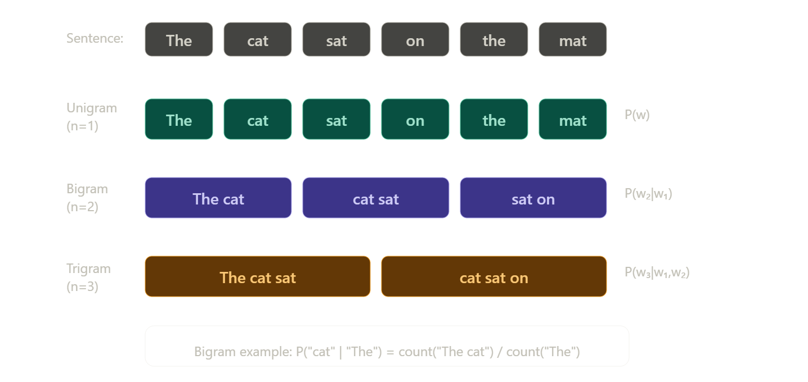
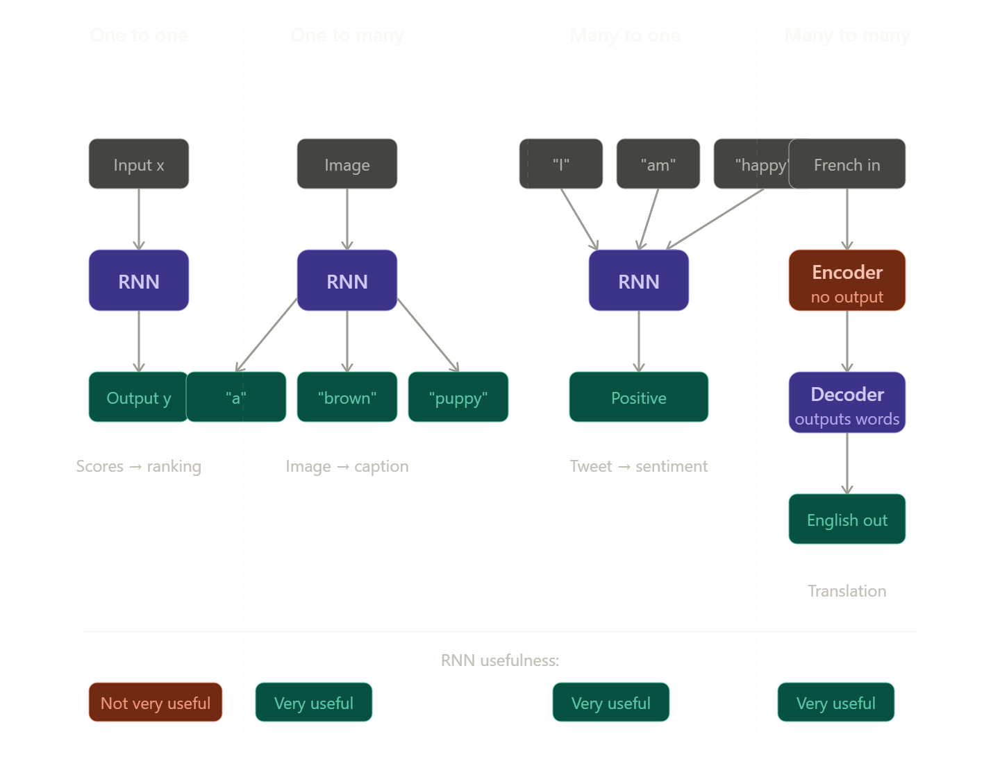
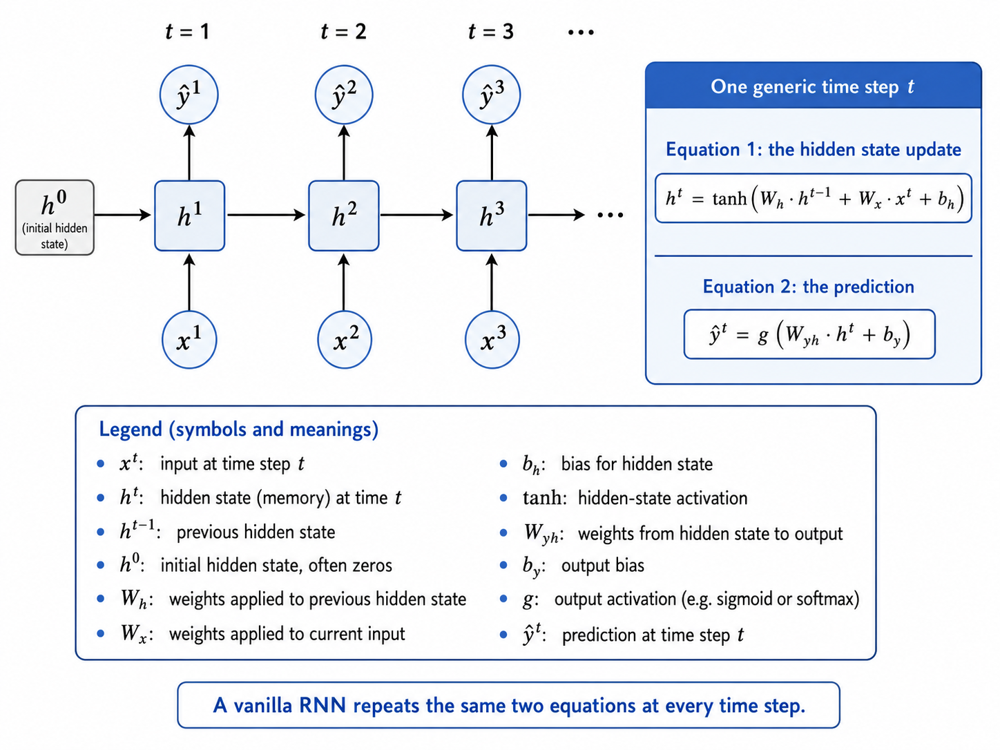
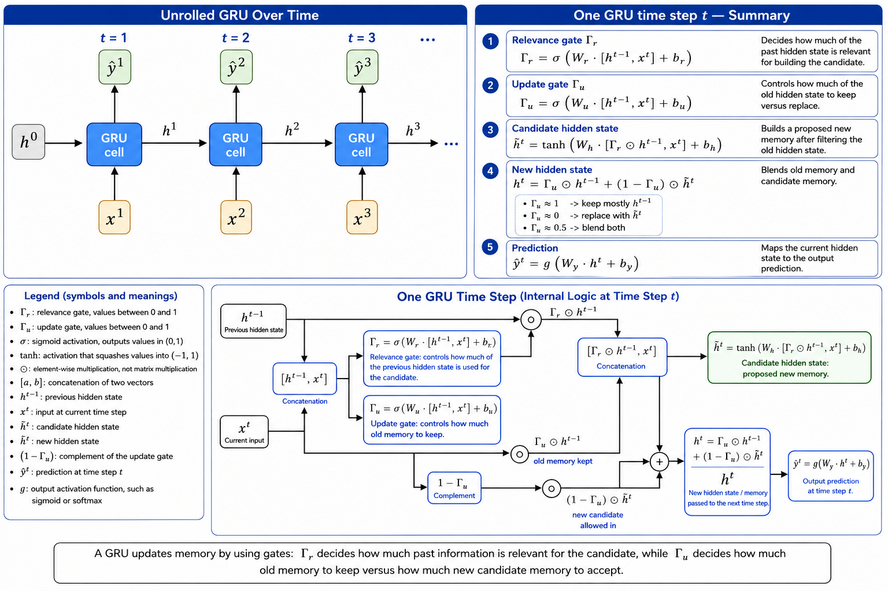
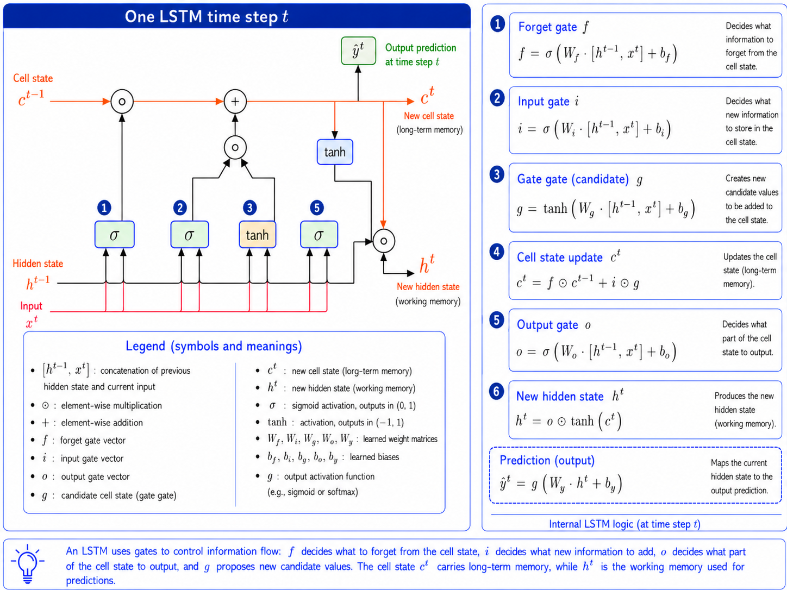

<style>
/* General note styling */  
  body {
    font-size: 130%;
  }

    img {
    display: block;
    margin: 20px auto;
    max-width: 70%;
    }

    .math {
    text-align: center;
}
</style>

# NLP using sequential models

## Neural Networks


Every word in the training set has a corresponding integer and each tweet has a vector representation of all words inside it.  
The size of the vector representation is = to the size of the longest tweet.  
Every other tweet have 0s to match the size of the longest tweet which known as **padding.**  

---

## Neural Networks layers  

- Dense layer: A layer where each Neural is connected to the all neurons  of the previous layer  
  
- ReLU: Transforms a neuron's output by outputting the input directly if it is positive, and returning zero for all negative values.

- Embedding layer: Takes an index assigned to each word from the vocabulary, and maps it to a representation of that word with a determined dimension.
- Mean layer: A layer that takes the mean of each feature from the embedding, and it output the same number of features as teh embedding sites. It doesn't have any trainable parameters.

## Traditional language models

### N-grams

An n-gram is a sequence of n consecutive words (or characters) from a text. The idea is that you can estimate the probability of a word based on the words that came before it.  

$$P(w2|w1) = \frac{\text{count(w1,w2)}}{\text{count(w1)}} → Bigrams$$  
$$P(w3|w1,w2) = \frac{\text{count(w1,w2,w3)}}{\text{count(w1,w2)}} Trigrams$$  
$$P(w1,w2,w3) = P(w1) \times P(w2|w1) \times P(w3|w2)$$  

 

#### Limitations of N-gram

- Large N-grams needed to capture dependencies between distant words.
- Exponential growth: Increasing n gives better context byt explodes the vocabulary size which needs a lot of space and RAM.
- Sparsity problem: most word combinations never appear in training, its count is 0 making P = 0. The model assigns zero probability to valid sentences it just never saw it. Smoothing techniques (like Laplace smoothing) patch this but don't fully solve it.
- Fixed context window: an n-gram only looks back n-1 words. A bigram is completely blind to anything beyond the previous word.
- No semantic understanding: n-grams are pure statistics over word sequences. "Dog bites man" and "canine attacks person" are completely different patterns to an n-gram model, even though they mean the same thing.  

---

## Recurrent neural networks (RNN)

An RNN process a sequence one token at time, maintaining a hidden state that gets updated at each step. The key idea: the hidden state is a form of memory, it carries information from previous steps into the current one.  

At each step $t$:

- Input: current word $x_t$ (as vector/embedding)
- previous hidden state:  $h_{t-1}$
- New hidden state $h_t = tanh (W_x \cdot X_t + W_h \cdot h_{t-1} + b)$
- Output $y_t = W_{\gamma} \cdot h_t$  

The same weight matrices ($W_x W_h W_{\gamma}$) are reused at every step, that's what "recurrent" means


---

### Why is RNN better than n-grams (what is solved)

- **Unlimited context window**: the hidden state theoretically carries information form the very first token all the way to the current one. There is no fixed n; every previous word influences the current hidden state.

- **No sparsity problem**: instead of counting raw co-occurrences, the RNN learns continuous vector representations (embeddings). Two words that appear in similar contexts get similar embeddings, so the model generalizes across unseen combinations naturally.
  
- **Semantic compression**: the hidden state is a dense vector that compresses *meaning*, not just word identity. Related sentences get similar hidden states even if they use different words.

- **No exponential storage growth**: the model parameters are fixed regardless of sequence length. The RNN doesn't need a lookup table that grows with the vocabulary size the way n-gram count tables do

 

---

### Applications of RNNs

 

**One to one task**: A single input produces a single output. Ex: a list of football scores (input) used to predict leaderboard position (output).  
The Rnn is not very useful here as this is barely different from a regular feed forward neural network. The RNN just adds a hidden state $h_0$, but since there's no real sequence to process that hidden state doesn't do anything meaningful. A standard neural network handles this just fine.  

**One to Many task**: A single input generates a sequence of outputs.Ex an image (single input) → a caption in English (multiple word output).  
The RNN is very useful as after reading the image once, the RNN needs to generate words one by one, where each word depends on the previous ones. That's exactly what the hidden state is good for, it carries context from one generation step to the next, allowing the model to produce coherent multi-word output instead of independent random words.  

**Many to one task**: A sequence of inputs collapses into a single output. Ex a tweet like "I am very happy" (multiple words) → a single sentiment label (positive or negative).  
The RNN is very useful as it reads every word one at a time, propagating information from the beginning to the end. By the time it reads the last words, the hidden state has accumulated context from the entire sentence. A single output is then produced from this final hidden state. without sequential processing, the model couldn't capture that "not" earlier in a sentence negates a word that comes much later.  

**Many to many task**: Multiple inputs produce multiple outputs. Ex in machine translation: French sentences (multiple words) → English sentences (multiple words). This uses an encoder-decoder architecture.  
The encoder reads the entire French sentence word by word, but produces no outputs. Its job is purely to compress the full meaning of the sentence into a single dense hidden state representation. That's why it is called "encoder" as it encodes the sequence into one representation.  
The decoder then takes that compressed representation and generates the English translation word by word. Each step uses the previous hidden state plus the previously generated word to produce the next word.  
The RNN is very useful and **this is arguably where RNNs shine most**. The encoder-decoder pattern become the foundation of machine translation systems before transformers took over. The ability to propagate information across an entire sequence, both encoding a full source and decoding a full target is exactly the strength RNNs have over n-grams, which could never handle variable-length input-to-output mappings at all

### Limitations of RNN

- **Vanishing gradient**: this is the biggest one. During back propagation through time (BBTT), gradients gut multiplied together at every step. When those values are < 1 (which they often are after a tanh activation), multiplying them across 50+ steps makes the gradient shrink to essentially zero. The early lyers in the sequence stop learning. In practice, this means an RNN effectively forgets what happened more than ~ 10-20 steps ago, despite theoretically having unlimited context.

- **Exploding gradient**: the opposite can also happen; gradients grow uncontrollably large causing NaN values amd training collapse. Gradient clipping is used to manage this.  

- **sequential computation**: the RNN process tokens one at time in order, because step t depends on step t-1. This makes it impossible to parallelize across a sequence, which means it's slow to train on modern GPW hardware that thrives on parallel operations.

- **Long-range dependencies**: as a practical consequence of vanishing gradients, RNNs struggle with sentences like  "The trophy didn't fit in the suitcase because it was too big." Resolving what "it" refers to requires connecting tokens far apart, and a vanilla RNN often fails this

**LSTMs** and **GRUs** were invented specially to address the vanishing gradient problem by introducing gating mechanisms that let the network learn *what to remember and what to forget*. They are the natural evolution from vanilla RNNs

---

#### Solutions to vanishing gradient problems

1- Identity RNN with ReLU activation:  
The Idea: the vanishing gradient in vanilla RNN is caused by two things working against each other:  

- The wight matrix Wₕ gets multiplied by itself repeatedly across time steps.  
- The tanh derivative is always < 1, shrinking the gradient further each step.

The identity RNN fixes the weight matrix part by initializing Wₕ as the  **identity matrix** instead of random values:

$$W_h = I = \begin{bmatrix} 1 & 0 \\ 0 & 1 \end{bmatrix}$$

And replaces tanh with ReLU as the activation function.  

**Why the identity matrix helps?**

Because multiplying identity matrix by it repeatedly doesn't shrink or explode the gradient it leaves it unchanged.  

**Why ReLU instead of tanh?**

Because its derivative is either 0 or 1. That derivative of 1 means gradients pass through ReLU without being shrunk at all — unlike tanh whose derivative peaks at 1 but quickly drops towards 0 for large inputs

**The trade off**  

This works well at initialization but the identity constraint relaxes during training as weights update. It also introduces the dying **ReLU problem**; neurons that output 0 stop receiving gradients entirely and never recover. It is a useful trick but not a complete solution.

2- Skip connections (Residual connections):  

The idea: Skip connections is the most powerful and widely used solution. Instead of forcing information to pass through every layer's transformation, you add a direct shortcut that bypasses one or more layers entirely:

$$ h^t = F(h_{t-1} + h^{t+1}) $$  

Where F is whatever transformation the layer applies (weight multiply + activation). 
The `+ h^{t-1}` part is the skip connection, it adds the inputs directly to the output.

Why this kills the vanishing gradient?  

During backpropagation, gradients flow back through the network.
Without skip connections, the gradient must pass through every transformation, getting multiplied by small numbers at each step.
With a skip connection, the gradient has a direct highway back through the addition.

$$\frac{\partial h_t}{\partial h_{t-1}} = \frac{\partial F(h_{t-1})}{\partial h_{t-1}} + 1$$  

That `+ 1` means if `∂F/∂h` vanishes completely, the gradient is still at least 1.
Early layers always receive a signal regardless of how deep the network is.

Visually

``` text
Without skip:    x → [Layer] → [Layer] → [Layer] → output
                        ↑ gradient shrinks at each arrow

With skip:       x → [Layer] → [Layer] → [Layer] → output
                  \_____________↑___________↑
                     direct gradient highways
```

**The tradeoff**: Almost none, skip connections are essentially free. Thy became the foundation of RsNet (image recognition) and are baked into every modern architecture including Transformers. The only cost is a small amount of extra addition operations, which is negligible.  

---

#### Solutions to exploding gradient problems  

**Gradient clipping**  

The idea: when gradients grow uncontrollably  bly large (values like 10⁶), weight updates become enormous and training collapses.
Gradient clipping simply caps the gradient at a maximum threshold before the weight update

How it works: After computing the gradient vector g, check its norm $||g||$.  

If the norm exceeds a threshold (say 5.0), rescale the entire gradient vector so its norm equals exactly that threshold.  

**What this preserves?**  
The rescaling keeps the direction of the gradient identical, by making the vector shorter, not changing where it points.
So the weight update still moves in the right direction, just with a controlled step size.  

**Tradeoff**  
Gradient clipping is a safety measure, the tradeoffs are negligible in practice. It can slow down training but the slower convergence is usually barely noticeable.
Also the threshold is manual hyperparameter but picking it is a noe-time minor tuning step.

---

### Math of RNN

The core forward pass of a vanilla RNN at each time step is described by two equations  

Equation 1: the hidden state update  

$$ h^t = \tanh(W_h \cdot h^{t-1} + W_x \cdot x^t + b_h) $$  

Equation 2: the prediction

$$\hat{y}^t = g(W_{yh} \cdot h^t + b_y)$$  

These are the core forward-pass equations of a vanilla RNN. The same parameters `W_h`, `W_x`, `W_yh`, `b_h`, and `b_y` are reused at every time step.

**Weight and Bias Sizes**  

Where:

- $n_x$ = input size (embedding dimension)  
- $n_h$ = hidden state size
- $n_y$ = output size (number of classes)

| Parameter | Size | Why |
|-----------|------|-----|
| $W$ | $(n_h \times (n_x + n_h))$ | must match the concatenated input $[x^t, h^{t-1}]$ |
| $b_h$ | $(n_h \times 1)$ | one bias per hidden unit |
| $W_{yh}$ | $(n_y \times n_h)$ | maps hidden state to output size |
| $b_y$ | $(n_y \times 1)$ | one bias per output unit |

**Rule:** rows = output size, columns = input size.

**The meaning of the symbols:**

`xᵗ`: the input at time step t. For NLP, this is typically a word embedding vector (list of numbers representing the current word). Dimension: `[n_x * 1]` .  

`hᵗ`: the hidden state at time t. This is the memory, it encodes everything the RNN has seen up to and including step t. Dimension: `[n_h * 1]`.  

`hᵗ⁻¹`: the hidden state from the previous step. At t=1, this is $h^0$, which is typically initialized to a vector of all zeros.

`Wₕ`: weight matrix applied to the previous hidden state. Dimension: `[n_h * n_h]`. These weights control how much of the previous memory is transformed and carried forward.  

`Wₓ`: weight matrix applied to the current input. Dimension: `[n_h * n_x]`. These weights project the input into the hidden state space.  

`b_h`: bias vector for the hidden state. Dimension `[n_h * 1]`. It shifts the result before the activation.  

`tanh`: the activation function for the hidden state. It squashes any number into the range (-1, +1) which keeps the hidden state bounded, although vanilla RNNs can still suffer from vanishing or exploding gradients during training.  

`W_yh`: weight matrix applied to the hidden state to produce the output. Dimension" `[n_y * n_h]`.  

`b_y`: bias for the output layer. Dimension `[n_y * 1]`.  

`g`: a second activation function applied to get the final prediction. For sentiment analysis (positive/negative), this would be a sigmoid. For word prediction over a vocabulary, it would be softmax.

`ŷᵗ`: the prediction at time step t.  

 

---

#### Walking through math steps

Lets say the hidden state and input are both small 3-dimensional vectors, and the network is at step =2 processing the word "happy"

Step 1: multiply $h^{t-1}$ by $W_h$.
The previous hidden state (say `[0.5, -0.3, 0.8]`) gets multiplied by the $W_h$ matrix. This is standard matrix-vector multiply. The result is a new 3D vector, call it `v1`.  

Step 2:  multiply $x^t$ by $W_x$. The word embedding for "happy"  (say `[0.1, 0.9, 0.2]`) gets multiplied by the $W_x$ matrix. Another 3D vector, call it `v2`.  

step 3: add element-wise and add bias `z = v1 + v2 + b_h`. The three vectors are just add together, position by position. This is what is meant by "element-wise sum".  

Step 4: apply tanh: `hᵗ = tanh(z)`. Apply tanh to each element of `z` individually. If `z` had a value of 3.2 in one position, `tanh(3.2) ≈ 0.997`. If it had -0.5, `tanh(-0.5) ≈ -0.462`. Every value is now squashed into the range (-1, 1). This becomes the new hidden state, and also gets passed to the next step.

Step 5: compute the prediction: `ŷᵗ = g(W_yh · hᵗ + b_y)`. The hidden state is multiplied by another weight matrix `W_yh`, bias is added, then a final activation function `g` is applied.
For sentiment classification, `g` would usually be sigmoid, giving a number between 0 (negative) and 1 (positive). In many sentiment models, this prediction is made from the final hidden state rather than at every time step.  

---

#### RNN cost function

In a normal multi-class classification problem, one input produces one prediction vector:

$$
\hat{y} = [\hat{y}_1, \hat{y}_2, ..., \hat{y}_k]
$$

where `k` is the number of classes.

The true label `y` is usually one-hot encoded. For example, if there are 3 classes:

```md
y = [0, 1, 0]
```

The cross-entropy loss for one prediction is:

$$
L = - \sum_{j=1}^{k} y_j \log(\hat{y}_j)
$$

Because `y` is one-hot, only the probability assigned to the correct class matters. So if the correct class is class `c`, the loss becomes:

$$
L = -\log(\hat{y}_c)
$$

This means the model gets a small loss when it assigns high probability to the correct class, and a large loss when it assigns low probability to the correct class.

For a vanilla RNN, the model can produce a prediction at every time step:

$$
\hat{y}^1, \hat{y}^2, ..., \hat{y}^T
$$

So instead of computing cross-entropy once, we compute it at every time step and then take the average over time:

$$
L = -\frac{1}{T} \sum_{t=1}^{T} \sum_{j=1}^{k} y_j^t \log(\hat{y}_j^t)
$$

Where:

`T`: total number of time steps in the sequence.

`k`: number of classes.

`y_j^t`: the true label value for class `j` at time step `t`.

`\hat{y}_j^t`: the predicted probability for class `j` at time step `t`.

The main idea:

For each time step, compare the RNN prediction `ŷᵗ` with the true label `yᵗ` using cross-entropy. Then average all time-step losses to get the loss for the whole sequence.

For the whole dataset, we repeat this process for every training example and average/sum the losses across all examples.

---

#### Example on RNN

**Setup:**  

**Task:** Classify the sentiment of "I love" (2 words, so T=2 steps).  
**Output:** single value at the last step only — ŷ² — where >0.5 means positive.  
**True label:** y = 1 (positive)
  
**Dimensions:**

- Input embedding size: n_x = 2

- Hidden state size: n_h = 2

- Output size: n_y = 1

---

**Given Values**:  
**Word embeddings:**

- x¹ = "I"    = [1, 0]ᵀ

- x² = "love" = [0, 1]ᵀ
**Initial hidden state:**
  
- h⁰ = [0, 0]ᵀ
**Weight matrices:**
  
```
Wₓ   = | 1   0 |      Wₕ  = | 0.5  0   |      W_yh = | 1  1 |
        | 0   1 |             | 0    0.5 |
```
  
**Biases:**
  
- b_h = [0, 0]ᵀ

- b_y = 0

---

**The Two Core Equations**  

**Hidden state update:**
> hᵗ = tanh( Wₓ · xᵗ + Wₕ · hᵗ⁻¹ + b_h )
  
**Prediction:**
> ŷᵗ = g( W_yh · hᵗ + b_y )
  
---
  
**Step 1 — Compute h¹ (processing "I")**:  
  
**First term — Wₓ · x¹:**
```
| 1  0 |   | 1 |   | 1 |
| 0  1 | × | 0 | = | 0 |
```
  
**Second term — Wₕ · h⁰:**
```
| 0.5  0   |   | 0 |   | 0 |
| 0    0.5 | × | 0 | = | 0 |
```
  
**Sum + bias:**
```
z¹ = [1, 0] + [0, 0] + [0, 0] = [1, 0]
```
  
**Apply tanh element-wise:**
```
h¹ = tanh([1, 0]) = [tanh(1), tanh(0)] = [0.762, 0]
```
  
---
  
**Step 2 — Compute h² (processing "love")**:  
  
**First term — Wₓ · x²:**
```
| 1  0 |   | 0 |   | 0 |
| 0  1 | × | 1 | = | 1 |
```
  
**Second term — Wₕ · h¹:**
```
| 0.5  0   |   | 0.762 |   | 0.381 |
| 0    0.5 | × | 0     | = | 0     |
```
  
**Sum + bias:**
```
z² = [0, 1] + [0.381, 0] + [0, 0] = [0.381, 1]
```
  
**Apply tanh element-wise:**
```
h² = tanh([0.381, 1]) = [tanh(0.381), tanh(1)] = [0.365, 0.762]
```
  
> **Note:** h² carries information from both "I" (via h¹ flowing through Wₕ) and "love" (via x²). That is the memory working.
  
---
 
**Step 3 — Compute the Prediction ŷ²**:  
  
**W_yh · h² + b_y:**
```
[1  1] × | 0.365 | + 0 = 0.365 + 0.762 = 1.127
          | 0.762 |
```
  
**Apply sigmoid (g = σ for binary classification):**
```
ŷ² = σ(1.127) = 1 / (1 + e^{-1.127})
              = 1 / (1 + 0.324)
              = 1 / 1.324
              ≈ 0.755
```
  
---
  
**Step 4 — Compute the Loss**  
  
**Binary cross-entropy:**
```
L = -(y · log(ŷ) + (1 - y) · log(1 - ŷ))
  = -(1 · log(0.755) + 0 · log(0.245))
  = -log(0.755)
  ≈ 0.281
```
  
The model predicted **0.755** (positive), true label was **1** (positive) → loss is low ✓
  
---
  
**Summary**:  
  
| Step | Operation | Result |
|------|-----------|--------|
| t=1 input | x¹ = "I" = [1, 0] | — |
| t=1 hidden | tanh(Wₓ·x¹ + Wₕ·h⁰ + b_h) | h¹ = [0.762, 0] |
| t=2 input | x² = "love" = [0, 1] | — |
| t=2 hidden | tanh(Wₓ·x² + Wₕ·h¹ + b_h) | h² = [0.365, 0.762] |
| prediction | σ(W_yh · h² + b_y) | ŷ² = 0.755 |
| loss | -log(ŷ²) | L ≈ 0.281 |
  
---
  
**Key Insight**  
  
The hidden state is the thread connecting all time steps.  

- After t=1: h¹ encodes only "I"  

- After t=2: h² encodes both "I" and "love"  

- The final prediction is made from h², which carries the full context of the sentence

If the model had predicted 0.2 instead of 0.755, the loss would be -log(0.2) ≈ **1.609** — much higher, which is what drives weight updates during back propagation.  

---

## Gated recurrent unites  

GRU networks are a type of RNN designed to handle sequential data while reducing the complexity of traditional RNN.

**What problem does GRu solve?**  
Vanilla RNN updates its hidden state at every step with the same formula regardless of what the input is.  
Over long sequences, early information gets diluted an eventually vanishes, the vanishing gradient problem.  
The GRU fixes this by adding two gates that act as filters, deciding what to keep and what to override.

---

### Math of GRU

At every time step t, a GRU runs 4 equations in this exact order:

**Equation 1 — Relevance gate Γᵣ**  
$$\Gamma_r = \sigma\left( W_r \cdot [h^{t-1}, x^t] + b_r \right)$$  

Controls how much of the previous hidden state is relevant to computing the candidate. Output is between 0 and 1. close to 0 means "ignore the past." Close to 1 means "the past matters here."  

**Equation 2 — Update gate**  
$$\Gamma_u = \sigma\left( W_u \cdot [h^{t-1}, x^t] + b_u \right)$$  

Controls how much of the **old hidden state keep** vs how much to replace with the new information. This is the core memory mechanism

**Equation 3 — Candidate hidden state**  
$$\tilde{h}^t = \tanh\left( W_h \cdot [\Gamma_r \odot h^{t-1},\ x^t] + b_h \right)$$  

The ⊙ means element-wise multiplication. The relevance gate is applied to the previous hidden state first. If the Γᵣ is close to 0, the previous state is mostly erased before computing the candidate. This is the "proposal" for what the new hidden state could be.  

**Equation 4 — New hidden state**  
$$h^t = \Gamma_u \odot h^{t-1} + (1 - \Gamma_u) \odot \tilde{h}^t$$  
The most important equation. The update gate Γᵤ acts as a blending switch:  

- when Γᵤ ≈ 1 → Keep almost all of the old hidden state hᵗ⁻¹ (ignore the candidate).

- when Γᵤ ≈ 0 → replace the hidden state entirely with the candidate h̃ᵗ

- when Γᵤ ≈ 0.5 → blend both equally  

**Equation 5 — Prediction**  
$$\hat{y}^t = g\left( W_y \cdot h^t + b_y \right)$$  

Same as vanilla RNN, apply an activation function to the current hidden state.  

The meaning of the symbols:

`Γᵣ`: Relevance gate, a vector of values between 0 and 1, controlling how much of the past hidden state is used when computing the candidate.  

`Γᵤ`: Update gate, a vector of values between 0 and 1, controlling how much of the old hidden state to keep vs replace.  

`σ`: Sigmoid function, squashed any number into (0,1).  

`tanh`: Hyperbolic tangent. squash any number into (-1,1). Used for the candidate hidden state.  

`⊙`: Element-wise multiplication (Hadamard product), multiply two vectors position by position, NOT matrix multiplication.  

`[a,b]`: Concatenation, stacking two vectors into one longer vector, e.g. [0.8, 0.4] and [0, 1] → [0.8, 0.4, 0, 1].  

`hᵗ`: Hidden state at current time step t, the memory the GRU passes forward.  

`hᵗ⁻¹`: Hidden state at previous time step, the memory inherited from the past.  

`h̃ᵗ`: Candidate hidden state,the proposed new memory, not yet committed.  

`xᵗ`: Input at step t.  

`Wᵣ`: weight matrix for the the relevance gate.

`Wᵤ`: weight matrix for the update gate.  

`Wₕ`: weight matrix for the candidate computation.  

`Wᵧ`: weight matrix for the output prediction.  

`bᵣ`: Bias vector for the the relevance gate.

`bᵤ`: Bias vector for the update gate.  

`bₕ`: Bias vector for the candidate hidden state.  

`bᵧ`: Bias vector for the output.  

`ŷᵗ`: Predicted output at time step t.

`g`: Output activation function, sigmoid for binary classification, softmax for multi-class.  

`(1 − Γᵤ)`: The complement of the update gate, what fraction of the candidate to let in, if Γᵤ keeps 70% of the old state, this brings in 30% of the new candidate.  


  

---

## Bidirectional RNNs (BRNNs)  

**The problem with vanilla RNN**  
A vanilla RNN only read teh sequence left to right, it only knows what come before the current word. For example
> "I was trying really hard to get a hold of ___. Louise finally answered..."  

A vanilla RNN reading left to right reaches the blank and has no idea "Louise" is coming in the next sentence. It has to guess between "her", "him", "them."  

A human reads the next sentence and immediately fills the blank with "her", because humans naturally use context from both direction.  

How BRNN solve this
A BRNN  runs two independent RNNs simultaneously on the same sequence:

- Forward RNN → reads left to right, produces hidden state h¹, →h², ..., →hᵀ  

- Backward RNN → reads right to left, produces hidden states ←h¹, ←h², ..., ←hᵀ  

The two directions are **completely independent**, meaning no loops between directions. They are just run in parallel, and you can start from either left or right with no problem.  

**The prediction equation**  

At each time step t, both hidden states are concatenated and used together to make the prediction:

$$ 
\hat{y}^t = g(W_y \cdot [\overrightarrow{h}^t, \overleftarrow{h}^t] + b_y)
 $$  

This is identical to the vanilla RNN output equation, except instead of just hᵗ you now feed in both hidden states joined together.  

---

## Deep RNNs

**The idea**  
A vanilla RNN is one layer deep, at each time step, one hidden state is computed and a prediction is made. 
A deep RNN stacks **multiple RNN layers on top of each other**, exactly like how a deep feed-forward network stacks multiple dense layers.  

**How information flows**  

1- **Horizontally - through time**: at each layer, the hidden state is passed from step t to step t+1, just like a vanilla RNN.

2- **Vertically - through layers**: the hidden state output of layer 1 at step t becomes the input to layer 1 + 1 at the same step t.This is identical to how activations flow upward through layers in a regular deep network.  

**The equation**  

For layer 1 at time step t, the two equations are the same as vanilla RNN just with a superscript for the layer number:  
$$
h_t^{(l)} = g(W^{(l)} h_t^{(l-1)} + U^{(l)} h_{t-1}^{(l)} + b^{(l)})
$$  

The only difference from vanilla RNN is that `xᵗ` is replaced by `hᵗ⁽ˡ⁻¹⁾`, the hidden state from the layer blow. The first layer still takes the raw word embedding as input.

**Why depp RNNs capture more that shallow ones?**  
A single-layer RNN can only learn one level of abstraction. Stacking layers lets each layer build on top of the previous one, exactly like in deep fed-forward networks:

- Layer 1: learns low-level patters (individual word features)  
- Layer 2: learns combinations of those patters (phrases, local context)  
- Layer 3: learns higher-level abstraction (sentence meaning, topic)  

---

## Long short-term memory (LSTM)

LSTMs are most well-known solution to the vanishing gradient problem, GRUs also addressed this, but LSTMs came first and are more widely known.
The core idea is the same: learn what to remember and what to forget, rather than blindly updating the hidden state at every state at every step like a vanilla RNN.  

**The two states**: Unlike vanilla RNN which has only one hidden state h, an LSTM carries two things through time:

- Cell state (C): the long term memory, it is like a conveyor belt running through the entire sequence, carrying important information across many steps with minimal interference.  
- Hidden state  (H): the working memory, this where active computations happen at each step, and it's also what produces the output.  

The separation of these two states is what makes LSTMs powerful, the cell state can preserve information from much earlier in the sequence without it being overwritten at every step.  

**The Three gates**: at each step, information flows through three gates. Each gate is a filter that decides how much information to let through:

- Forget gate: looks at current input and the previous hidden state, then decides which parts of the cell state are no longer useful and throws them away. This is the "stop remember this" mechanism.

- Input gate: decides which new information from the current input and previous hidden state is relevant enough to be added to the cell state. This is the "start remembering this" mechanism.

- Output gate: decides which parts of the updated cell state are relevant right now, and uses them to produce the hidden state and the prediction at this time step. This is "what do I say right now" mechanism.

**The phone call analogy**  

The lecture gives a great intuition for this. When your phone rings you're thinking about unrelated things — the forget gate clears those out. As your friend starts talking, the input gate picks up what's relevant to the conversation and adds it to your memory. As the conversation continues, the output gate decides what from your memory is relevant to say at each moment. By the end of the call your memory contains the most important parts of the conversation — that's the cell state after the full sequence.  

**Applications on LSTMs:**  

- Next-character prediction.
- chat bots.
- Music composition.
- Image captioning.
- Speech recognition.

---

### Math of LSTM  

Equation 1 Forget gate:

$$f = {\sigma} (W_f [h_{t-1} ; x_t ] + b_f)$$

- Takes $h^{t-1}$ and $x^{t}$ concatenates them, then multiplies by Wf, then add bias.  
- Sigmoid activation function squashes output to (0,1)
- This vector multiples the old cell state $C^{t-1}$, values near 0 erased, while values near 1 are kept
- Its job to decide what to forget from the long term memory.

Equation 2 Input gate:

$$i = {\sigma} (W_i [h_{t-1} ; x_t ] + b_i)$$

- Same structure as forget gate but with its own weights $W_i$
- Apply sigmoid activation and output i is a vector between (0,1)
- Acts as a filter on the candidate, it decides which new information is relevant enough to write
- Its job is to decide how much of the proposed new information to accept

Equation 3 Gate gate / candidate cell state

$$g = tanh (W_g [h_{t-1} ; x_t ] + b_h)$$

- Same inputs, but uses tanh instead of sigmoid to output g is a vector between (-1,1)
- This is the proposed new content, everything that could be written to cell state
- It does not get written directly, the input gate (equation 2) filters it first 
- Its job to propose what new content could me added to the memory

Equation 4 Cell state update

$$c_t = f ⊙ c_{t-1} + i ⊙ g$$

- Left term f ⊙ Cᵗ⁻¹: take the old memory, multiply by the forget gate, this zeros out the parts marked for deletion
- Right term i ⊙ g: take the candidate, multiply by the input gate, this keeps only the relevant new content
- Add both terms together to get the updated cell state
- There is no activation function here, just addition. This is why gradients can flow back through many steps without shrinking 
- Its job is to update the long-term memory by erasing old and writing new

Equation 5 Output gate

$$o = {\sigma} (W_o [h_{t-1} ; x_t ] + b_o)$$

- Same structure as the other gate but with its own weights $W_o$
- Have sigmoid activation so the output is a vector between (0,1)
- The cell state at this point holds everything the network has remembered, the output gate reads it and decides which parts are actually useful to output right now
- Its job is to decide what part of the current memory is relevant to output at this step

Equation 6 New hidden state

$$h_t = o_t ⊙ tanh(c_t)$$

- Pass the updated cell state through tanh to squash it to (-1,1)
- Multiply the result by the output gate, this keeps only the currently relevant parts
- The result $h^t$ is the new hidden state, used to make the prediction $\hat{y}^t$ and passed as input to the next time step
- Its job is to produce the active working memory and the output for this step

**All together**  

1- Forget gate: $f = {\sigma} (W_f [h_{t-1} ; x_t ] + b_f)$  
2- Input gate: $i = {\sigma} (W_i [h_{t-1} ; x_t ] + b_i)$  
3- Gate gate: $g = tanh (W_g [h_{t-1} ; x_t ] + b_h)$  
4- Cell state update: $c_t = f ⊙ c_{t-1} + i ⊙ g$  
5- Output gate: $o = {\sigma} (W_o [h_{t-1} ; x_t ] + b_o)$  
6- New hidden state: $h_t = o_t ⊙ tanh(c_t)$  

**The meaning of the symbols:**  

`[ht−1​;xt​]`: concatenation of previous hidden state and current input  

`⊙`: Element-wise multiplication  

`f`: Forget gate vector

`i`: Input gate vector  

`g`: Candidate cell state (gate gate)  

`o`: Output gate vector  

`ct​`: New cell state (long-term memory)  

`ht​`: New hidden state (working memory)  

`Wf​,Wi​,Wg​,Wo​`: Separate learned weight matrices for each gate  

`bf​,bi​,bg​,bo​`: Separate learned biases for each gate

  

---

## Named entity recognition  

Named entity recognition (NER) is a component of NLP that locates and extract predefined categories of objects in body of text (e.g. places, organizations, names, time and dates.)  

**Types of entities**  

- Geographical entity (e.g. The Nile).
- Geopolitical entity (e.g. Egypt).
- Organization (e.g. Google).
- Time indicator (e.g. December).
- Artifact (e.g. Egyptian statue).
- Person name.  

**Application of NER systems**  

- Search engine efficiency
- Recommendation engines
- Customer service
- Automatic trading

---

### Training NER

**Processing data for NERs**  

- Assign each class (Person name,Geographical entity, etc.) a number.  
- Assign each word a number.  

**Token Padding**  

For LSTMs, all sequences need to be the same size

- Set sequence length a certain number.
- Use the `<PAD>` to fill empty spaces.  

**Training the NER**  

1. Create a tensor for each input and its corresponding number.  

2. Create a data generator to put them in batches, ideal to be a power of 2 (64, 128, 256, ...).  

3. Feed it into an LSTM unit.  

4. Run the output through a dense layer.  

5. Predict using a log softmax (instead of softmax) over k classes.  

**Computing Accuracy (Evaluating the model)**  

1. Pass test set through the model.

2. Compute the arg max (the point were your function reach its maximum) across the prediction array.  

3. Mask padded tokens (makes the arrays the same length).  

4. Compare the outputs against test labels.  
